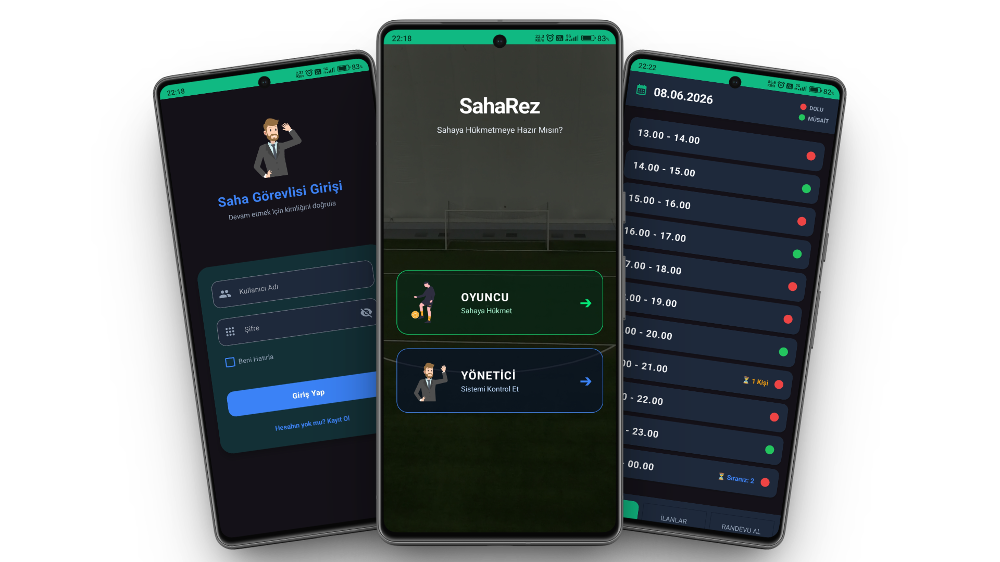
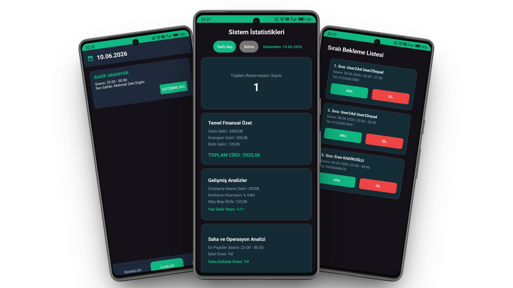

# ⚽ SahaRez - Halı Saha Rezervasyon ve Yönetim Sistemi &nbsp;  

 

## 🇹🇷 Türkçe Proje Açıklaması
**SahaRez**, halı saha işletmecileri ve oyuncular için geliştirilmiş, yüksek performanslı ve kullanıcı dostu bir rezervasyon yönetim platformudur. Bu proje, "Offline-First" (çevrimdışı çalışma) mimarisi ile geliştirilmiş olup, internet bağlantısının olmadığı durumlarda bile kesintisiz kullanıcı deneyimi sunar.

### 📂 Proje Yapısı (Monorepo)
Proje, sürdürülebilirlik ve düzen için modüler bir yapıda tasarlanmıştır:
* **`/android`**: Kotlin ile geliştirilen, MVVM mimarisine sahip Android istemcisi.
* **`/backend`**: RESTful API servisleri için geliştirilen PHP mimarisi ve MySQL veritabanı.

### 🎯 Temel Özellikler
- [x] **Rol Yönetimi:** Yönetici ve Oyuncu panelleri.
- [x] **Offline-First:** Room Database desteği ile senkronizasyon.
- [x] **Akıllı Rezervasyon:** Bekleme listesi ve anlık onay mekanizması.
- [x] **İlan Sistemi:** Rakip bulma ve ekipman kiralama özellikleri.

### 📸 Proje Ekran Görüntüleri

 

---
### 👤 İletişim

&nbsp;&nbsp;&nbsp;

 

---
---
---
 

## 🇺🇸 English Project Description
**SahaRez** is a high-performance reservation management platform developed for turf field operators and players. This project is built with an "Offline-First" architecture, ensuring a seamless user experience even when there is no internet connection.

### 📂 Project Structure (Monorepo)
Project is designed in a modular structure for sustainability:
* **`/android`**: Android client developed with Kotlin, featuring MVVM architecture.
* **`/backend`**: PHP architecture developed for RESTful API services and MySQL database.

### 🎯 Key Features
- [x] **Role Management:** Admin and Player panels.
- [x] **Offline-First:** Synchronization support with Room Database.
- [x] **Smart Reservation:** Waiting list and instant confirmation mechanisms.
- [x] **Ad System:** Finding opponents and equipment rental features.

### 📸 Project Secreenshots

 

---
### 👤 Contact

&nbsp;&nbsp;&nbsp;
